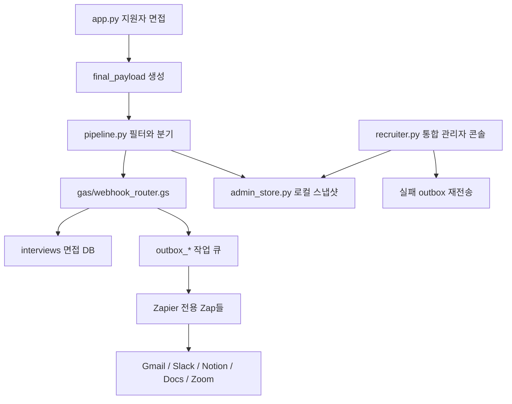

# HireCopilot AI Agent

학교 프로젝트용 AI 채용 인터뷰 자동화 MVP입니다. 지원자는 `app.py`에서 AI 면접을 보고, 운영자는 `recruiter.py` 통합 관리자 콘솔에서 면접 결과, 파이프라인 상태, outbox 재전송, Zapier 연결 가이드를 확인합니다.

핵심 원칙은 간단합니다.

- 판단 로직은 Python 코드가 담당합니다: 면접 평가, 자격 필터, 추천/보류/비추천 분기, 2차 질문 생성.
- Google Sheets는 데이터 허브입니다: `interviews`는 면접 DB, `outbox_*`는 앱별 작업 큐입니다.
- Zapier는 앱 연결만 담당합니다: 각 outbox 탭의 새 행을 트리거로 Gmail, Slack, Notion, Docs, Zoom에 연결합니다.

## 전체 구조



기존처럼 `interviews` 새 행 하나를 트리거로 30단계짜리 Zap에서 Filter, Paths, Delay, AI 호출을 처리하지 않습니다. 그 방식은 열 번호와 분기 키워드가 조금만 바뀌어도 깨지기 쉽습니다. 이 프로젝트는 로직을 코드에 두고, Zapier는 각 앱의 OAuth와 액션 실행만 맡깁니다.

## 주요 앱

### 지원자 면접 앱: `app.py`

- 이름, 이메일, 학력, 경력, 학점, 지원 포지션을 입력받습니다.
- OpenAI 모델로 한국어 AI 면접을 진행합니다.
- 면접 종료 후 5개 루브릭 점수와 `hiring_opinion`을 생성합니다.
- `pipeline.py`를 호출해 Google Sheets 저장과 outbox 큐잉을 실행합니다.

### 통합 관리자 콘솔: `recruiter.py`

- 대시보드: 최근 면접 수, 추천/보류/비추천, 자격 필터, 실패 outbox 현황.
- 지원자/면접 결과: 평가 JSON, 요약, 우려사항, 대화록 확인.
- outbox/파이프라인: 액션별 성공/실패 상태 확인, 실패 outbox 재전송.
- Zapier 연결 가이드: outbox 탭별 Trigger/Action/필드 매핑 확인.
- 채용 담당 설정: 포지션과 공통 평가 기준 관리.

### 파이프라인: `pipeline.py`

`pipeline.py`는 면접 이후의 2차 자동화 로직을 담당합니다.

1. GAS 웹훅으로 `interviews` 탭에 면접 결과 저장.
2. 기본 자격 필터 확인:
   - 이메일에 `@` 포함
   - 학점이 커트라인 초과 (동점은 탈락)
   - 학위 입력
   - 경력 입력 (옵션: 신입 제외)

   필터 값(학점 커트라인, 학점 필수 여부, 신입 제외)은 관리자 콘솔의
   "채용 담당 설정" 탭에서 변경할 수 있으며, `.env`의 `PIPELINE_*` 값보다 우선합니다.
3. `hiring_opinion`에 따라 outbox 생성:
   - `추천`: Notion 등록, 최종 합격 메일 예약(`outbox_scheduled`), 관리자 Slack/Email 알림
   - `보류`: 관리자 Slack/Email, Notion, Zoom, Docs용 2차 질문
   - `비추천`: 지원자 탈락 안내 Email
4. `pipeline_log`에 처리 결과 기록.

## Google Sheets와 outbox

스프레드시트 ID:

```text
1swaf7dyRsVRxepLJAXVoPO3YRNV0aPYmcBLL4_tPnbE
```

`gas/webhook_router.gs`는 POST payload의 `target` 값에 따라 알맞은 탭에 행을 추가합니다.

```json
{
  "target": "outbox_email",
  "row": ["timestamp", "to@example.com", "subject", "body", "from_name"]
}
```

탭이 없으면 GAS가 헤더와 함께 자동 생성합니다.

| 탭 | 역할 | Zapier 필요 여부 |
|---|---|---|
| `interviews` | 면접 결과 DB | 불필요 |
| `outbox_email` | Gmail 발송 큐 | 필요 |
| `outbox_slack` | Slack DM 큐 | 필요 |
| `outbox_notion` | Notion DB 항목 생성 큐 | 필요 |
| `outbox_docs` | Google Docs 텍스트 추가 큐 | 필요 |
| `outbox_zoom` | Zoom 미팅 생성 큐 | 필요 |
| `outbox_scheduled` | 최종 합격 메일 예약 큐 (HITL) | 필요 |
| `pipeline_log` | 파이프라인 로그 | 불필요 |

## Zapier 앱별 전용 Zap

각 앱마다 Zap을 하나씩 만듭니다. 모든 Zap의 Trigger는 Google Sheets의 해당 outbox 탭 `New Spreadsheet Row`입니다.

| outbox 탭 | Trigger | Action | 필드 매핑 |
|---|---|---|---|
| `outbox_email` | New Spreadsheet Row | Gmail Send Email | To=`to`, Subject=`subject`, Body=`body` |
| `outbox_slack` | New Spreadsheet Row | Slack Send Direct Message | User=`recipient`, Message=`message` |
| `outbox_notion` | New Spreadsheet Row | Notion Create Database Item | Name=`name`, Notes=`notes` |
| `outbox_docs` | New Spreadsheet Row | Google Docs Append Text | Text=`content`, 문서 ID는 Zap에서 고정 |
| `outbox_zoom` | New Spreadsheet Row | Zoom Create Meeting | Topic=`topic`, Start=`start_time_iso`, Duration=`duration_min` |
| `outbox_scheduled` | New Spreadsheet Row | Delay Until → Notion Find Item → Gmail Send Email | Delay=`send_after_iso`, Notion 검색=`candidate_name`, To=`to`, Subject=`subject`, Body=`body` |

`outbox_scheduled`만 예외적으로 Zap 안에 Delay Until과 Notion 조회가 들어갑니다. 추천 지원자의 최종 합격 메일은 관리자가 Notion에서 승인 체크박스를 켠 경우에만, 예약된 시각(`send_after_iso`, 다음날 오후 2시 KST) 이후에 발송됩니다. 사람의 승인(HITL)이 발송 게이트이며, 체크하지 않으면 메일은 나가지 않습니다.

예를 들어 Gmail 발송은 이렇게 움직입니다.

```text
pipeline.py가 outbox_email 행 생성
→ GAS가 Google Sheets outbox_email 탭에 append
→ Zapier의 outbox_email 전용 Zap이 New Row 감지
→ Gmail Send Email 액션이 to/subject/body를 매핑해 발송
```

이 구조를 쓰면 “메일 보내기”, “Slack 알림”, “Zoom 만들기” 같은 앱 연결은 Zapier에서 맡고, 누구에게 무엇을 보낼지는 코드와 대시보드에서 추적할 수 있습니다.

## 조별 활동 3인 구현 역할 분담

발표나 시연 기준이 아니라 실제 구현 작업 기준으로 나눕니다. 세 역할 모두 Python 코드, 외부 연동, 검증 작업이 하나씩 포함되도록 비중을 맞춥니다.

### 1명: Streamlit 화면과 관리자 UX 담당

- `app.py`의 지원자 면접 화면에서 온보딩, 채팅, 평가 완료 UX를 다듬습니다.
- `recruiter.py` 통합 관리자 콘솔의 대시보드, 지원자 결과, outbox 상태, Zapier 연결 가이드, 채용 설정 화면을 개선합니다.
- 관리자 콘솔에서 지원자 검색/필터, 결과 상세 보기, 실패 outbox 확인 같은 운영 기능을 확장합니다.
- Streamlit 세션 상태가 꼬이지 않도록 면접 재시작, 평가 완료, 관리자 로그인 흐름을 점검합니다.
- 담당 검증: 지원자 앱에서 면접을 끝낸 뒤 관리자 콘솔에서 같은 기록을 확인하고, 필요한 운영 버튼이 정상 동작하는지 확인합니다.

### 1명: 파이프라인 로직과 로컬 기록 담당

- `pipeline.py`의 자격 필터, 추천/보류/비추천 분기, outbox 액션 생성을 관리합니다.
- 보류 후보의 2차 질문 생성, Zoom 시간 계산, 관리자 알림 메시지 같은 후속 자동화 로직을 개선합니다.
- `admin_store.py`의 로컬 JSONL 저장/조회/갱신 구조를 관리하고, 중복 저장이나 재전송 결과 갱신 문제를 막습니다.
- `tests/test_pipeline.py`와 `tests/test_admin_store.py`를 관리합니다.
- 담당 검증: payload 하나를 넣었을 때 분기별 action 목록, 로컬 기록, 재전송 결과가 기대대로 나오는지 테스트합니다.

### 1명: GAS, Google Sheets, Zapier 연결 담당

- `gas/webhook_router.gs`의 `target` 라우팅과 `interviews`, `outbox_*`, `pipeline_log` 탭 헤더를 관리합니다.
- Google Sheets에서 `interviews`와 각 outbox 탭이 Zapier가 읽기 좋은 형태로 생성되는지 확인합니다.
- `outbox_email`, `outbox_slack`, `outbox_notion`, `outbox_docs`, `outbox_zoom` 전용 Zap의 Trigger/Action/필드 매핑을 구성합니다.
- `.env`, `GAS_WEBHOOK_URL`, Zapier 계정 연결, 앱별 OAuth 설정처럼 외부 연동에 필요한 설정을 관리합니다.
- 담당 검증: GAS로 outbox 행이 추가되면 각 전용 Zap이 Gmail, Slack, Notion, Docs, Zoom 중 연결된 앱으로 정확히 전달하는지 확인합니다.

## 실행

자세한 설치와 실행은 `SETUP.md`를 참고합니다.

```powershell
streamlit run app.py
streamlit run recruiter.py --server.port 8502
python -m unittest tests/test_pipeline.py tests/test_admin_store.py
```

## 프로젝트 구조

```text
HireCopilot_AI_Agent/
├── app.py
├── admin_store.py
├── pipeline.py
├── recruiter.py
├── recruiter_config.json
├── gas/
│   └── webhook_router.gs
├── tests/
│   ├── test_admin_store.py
│   └── test_pipeline.py
├── requirements.txt
├── README.md
├── SETUP.md
└── CLAUDE.md
```
