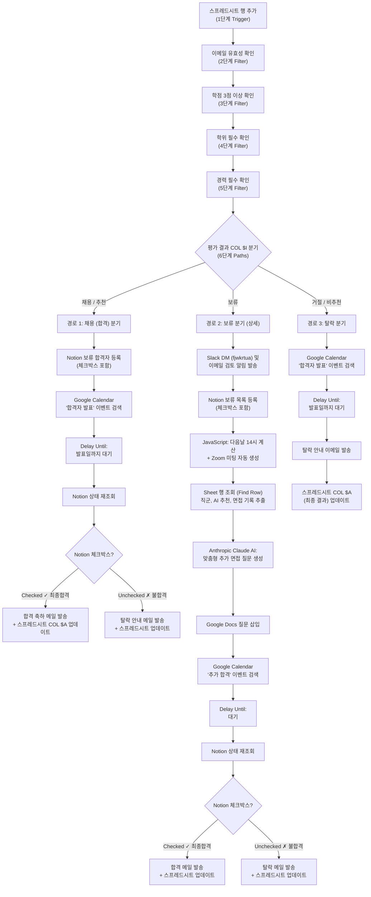

# 🎓 HireCopilot — AI 채용 인터뷰 자동화 에이전트

> **학교 프로젝트 MVP** 

지원자가 AI 면접관과 한국어로 대화하고, 면접이 끝나면 구조화된 평가 리포트가 **자동으로 구글 스프레드시트에 기록**되는 Streamlit 기반 채용 자동화 에이전트입니다.

---

## ✨ 주요 특징

### 🤖 AI 면접 자동화
- **GPT-4o-mini** 기반 AI 면접관이 한국어 존댓말로 면접 진행
- 채용 담당자가 설정한 **포지션별 평가 기준**을 자동 반영
- STAR 방식(상황-과제-행동-결과) 꼬리질문 자동 생성
- 지원자 답변 **6~8개** 후 면접 자동 종료

### 📋 온보딩 입력 폼
- 면접 시작 전 이름, 이메일, 학력, 경력, 학점, 지원 포지션 수집
- 필수 항목 미입력 시 면접 시작 차단

### 📊 5개 루브릭 자동 채점 (1~5점)
| 항목 | 설명 |
|---|---|
| `culture_fit` | 회사 인재상 적합도 |
| `customer_response` | 고객 응대 마인드 및 문제 해결력 |
| `ownership` | 주인의식과 자발성 |
| `communication` | 답변 명확성과 공감 표현 |
| `learning_agility` | 피드백 수용력과 적응 능력 |

### 📤 구글 스프레드시트 자동 기록
- 면접 종료 시 **Google Apps Script 웹훅**으로 전체 결과 자동 전송
- 기록 항목: 시간, 이름, 이메일, 포지션, 학력, 학점, 경력, 채용 의견, 채용 추천 이유, 총점, 항목별 점수, 요약, 추천 다음 단계, 전체 대화록

### 👔 채용 담당자 설정 페이지 (`recruiter.py`)
- 포지션 추가/수정/삭제 및 **포지션별 AI 면접 중점 기준** 입력
- 공통 채용 기준 입력
- 설정이 `recruiter_config.json`에 저장 → 다음 면접부터 AI에 자동 반영
- 암호 인증 보호

### 🛠️ 개발자 모드
- 토글 활성화 시 암호 인증 필요
- 면접 진행 중 **실시간 점수 시각화** (컬러 progress bar)
- 채용 의견(🟢 추천 / 🟡 보류 / 🔴 비추천) 표시
- 전체 대화록 및 raw JSON 확인 가능

### 🎭 Dummy 모드
- `OPENAI_API_KEY` 없이도 미리 준비된 질문으로 UI 전체 시연 가능

---

## 🔗 Zapier 2차 채용 자동화 파이프라인 (Zapier Automation Workflow)

이 프로젝트는 면접 결과가 Google 스프레드시트에 기록되는 것에서 끝나지 않고, **Zapier**를 통해 서류 및 기본 조건 검증부터 최종 합격/보류/탈락 처리에 이르는 **2차 채용 프로세스 자동화 파이프라인**을 매끄럽게 연결할 수 있도록 설계되어 있습니다.

### 📐 전체 워크플로우 아키텍처



---

### 📝 단계별 상세 가이드

#### 1️⃣ 1단계: 트리거 (Trigger) - 스프레드시트 행 추가
- **동작 앱**: Google Sheets (New Spreadsheet Row)
- **트리거 조건**: `HireCopilot database` 스프레드시트에 지원자의 면접 결과가 담긴 새로운 행(Row)이 추가되는 순간 Zap이 작동합니다.

#### 2️⃣ 2~5단계: 순차 필터링 (Basic Screening Filter)
네 개의 **Filter by Zapier** 단계를 순차적으로 거치며 지원자의 기본 자격을 검증합니다. 한 단계라도 필터를 충족하지 못하면 그 즉시 전체 자동화 프로세스(Zap)가 자동으로 중단(Stop)됩니다.
- **2단계**: 지원자의 이메일 유효성 확인 (`@` 포함 및 정상 도메인 형태 여부)
- **3단계**: 대학 학점이 **3.0 이상**인지 검증 (`COL $F` 학점 값)
- **4단계**: 필수 학위 소지 여부 확인 (`COL $E` 학력 조건 검증)
- **5단계**: 필수 경력 충족 여부 확인 (`COL $G` 경력 조건 검증)

#### 3️⃣ 6단계: 경로 분기 (Paths by Zapier)
기본 필터를 무사히 통과한 우수 지원자들은 스프레드시트의 **`COL $I` (평가 결과 / 채용 의견)** 값에 따라 **3가지 맞춤형 자동화 경로**로 분기되어 처리됩니다.

---

### 🛣️ 경로별 자동화 시나리오

#### 🟢 경로 1: 채용 (합격) 분기
> **조건**: `COL $I`에 `"채용"` (또는 AI 의견 `"추천"`)이 포함될 때 작동

1. **Notion 데이터베이스 기록**: Notion의 `2026 보류 합격자 목록` 데이터베이스에 지원자 인적사항과 면접 점수를 자동으로 추가하고, 관리자 검토를 위한 **체크박스**를 생성합니다.
2. **캘린더 연동 및 발표 대기**: Google Calendar에서 `합격자 발표` 이벤트를 자동으로 검색한 뒤, **Delay Until** 기능을 이용해 해당 이벤트의 일정(발표일)까지 전체 작동을 대기시킵니다.
3. **관리자 최종 결정 검증**: 약속된 발표일이 되면 Notion의 해당 지원자 페이지 정보를 다시 실시간 조회(Find Page)합니다.
4. **최종 분기 (중첩 Path)**: Notion 체크박스의 체크 여부에 따라 최종 액션이 나뉩니다.
   - **최종 합격 (체크 ✓)**: 지원자에게 최종 합격 축하 메일을 자동으로 발송하고, 스프레드시트의 `COL $A` (최종 결과)를 "최종 합격"으로 업데이트합니다.
   - **최종 탈락 (미체크 ✗)**: 탈락 안내 이메일을 발송하고 스프레드시트의 `COL $A`를 "최종 탈락"으로 업데이트합니다.

#### 🟡 경로 2: 보류 분기 (핵심 및 최고 난이도)
> **조건**: `COL $I`에 `"보류"`가 포함될 때 작동하며, 관리자 개입과 AI 추가 질문 생성을 결합한 매우 고도화된 연동입니다.

1. **멀티 채널 검토 알림**: 
   - 관리자 Slack 계정(`fjwkrtua`)으로 즉각적인 직메시지(DM)를 보내 우수 지원자의 검토를 알립니다.
   - 동시에 이메일로도 상세 검토 요청 알림을 동시 전송합니다.
2. **Notion 보류 목록 추가**: Notion의 보류 합격자 데이터베이스에 지원자를 등록하고 체크박스를 배치합니다.
3. **Zoom 인터뷰 자동 개설 (Scripting)**: **Code by Zapier (JavaScript)**를 활용하여 실시간으로 "다음날 오후 2시"를 정확히 계산하고, Zoom API를 연동하여 가상의 2차 면접 룸(Zoom Meeting)을 자동 생성합니다.
4. **추가 면접 컨텍스트 추출**: 스프레드시트에서 해당 지원자 행을 조회(Find Row)하여 **직군(`COL $E`)**, **1차 AI 추천 내용(`COL $S`)**, **1차 면접 전체 대화록(`COL $T`)**을 통째로 추출합니다.
5. **Claude AI 기반 맞춤 면접 질문 생성**: 추출된 1차 면접 컨텍스트를 **Anthropic Claude AI**에 전달하여, 1차 면접 중 부족했거나 추가 검증이 필요한 항목에 대한 **"2차 면접용 맞춤형 꼬리질문"을 자동으로 생성**합니다.
6. **문서 자동화 및 대기**: 생성된 맞춤 질문을 Google Docs 템플릿 문서의 지정 위치에 자동으로 삽입합니다. 이후 Google Calendar에서 `추가 합격` 이벤트를 검색해 해당 발표일까지 **Delay Until**로 대기합니다.
7. **최종 분기 (중첩 Path)**: 지정된 발표일에 Notion 데이터베이스의 체크박스 상태를 재조회합니다.
   - **보류 → 최종 합격 (체크 ✓)**: 최종 합격 이메일을 발송하고 스프레드시트를 최종 합격으로 업데이트합니다.
   - **보류 → 최종 탈락 (미체크 ✗)**: 정중한 거절 이메일을 발송하고 스프레드시트를 최종 탈락으로 업데이트합니다.

#### 🔴 경로 3: 탈락 분기
> **조건**: `COL $I`에 `"거절"` (또는 AI 의견 `"비추천"`)이 포함될 때 작동

1. **발표일 대기**: 타 지원자와의 일정을 맞추기 위해 Google Calendar에서 `합격자 발표` 이벤트를 조회하고, 해당 발표일 정시까지 **Delay Until**로 대기합니다.
2. **탈락 처리 자동화**: 대기 시간이 종료되면 정중하게 작성된 탈락 안내 이메일을 발송하고, 스프레드시트 `COL $A`를 "최종 탈락"으로 일괄 업데이트합니다.

---

### 🌟 자동화 파이프라인의 설계적 가치
- **휴먼 인 더 루프(Human-in-the-Loop)의 유연성**: AI가 1차 평가를 진행하고 2차로 다양한 서비스(Slack, Docs, Zoom)를 연동하되, **최종 결정 시점까지 대기(Delay)**한 후 Notion의 체크박스를 확인하게 설계하여 관리자의 실질적인 최종 판단 권한(인사 결정권)을 보장합니다.
- **맞춤형 면접 고도화**: 1차 면접에 부족했던 내용을 Claude AI가 파악해 2차 면접용 맞춤 질문을 Google Docs에 준비하고 Zoom까지 자동 연결하여 채용 비용과 시간을 극적으로 아껴줍니다.

---

## 📁 프로젝트 구조

```
HireCopilot_AI_Agent/
├── app.py                  # 지원자 면접 앱 (메인)
├── recruiter.py            # 채용 담당자 설정 앱
├── recruiter_config.json   # 채용 담당자 설정 저장 파일 (자동 생성)
├── requirements.txt        # Python 패키지 목록
├── .env                    # 환경 변수 (직접 생성)
└── README.md               # 본 문서
```

---

## 🚀 로컬 세팅 및 실행 방법

본 프로젝트를 로컬 Windows/PowerShell 환경에서 설정하고 실행하는 상세한 안내는 별도의 마크다운 가이드 문서로 분리하여 관리하고 있습니다. 

의존성 라이브러리 설치, 환경 변수(`.env`) 지정 및 실행 포트 제어 등에 관한 구체적인 단계는 아래 문서를 참고하세요.

👉 **[SETUP.md](SETUP.md) 파일에서 로컬 세팅 가이드 확인하기**

---

## 🗂️ Google Apps Script 연동 설정

### Apps Script 코드

Google 스프레드시트를 열고 **확장 프로그램 → Apps Script**에 아래 코드를 붙여넣고 배포합니다:

```javascript
function doPost(e) {
  try {
    var sheet = SpreadsheetApp.openById("스프레드시트 아이디").getActiveSheet();
    var data = JSON.parse(e.postData.contents);

    sheet.appendRow([
      data.timestamp || "",
      data.candidate_name || "",
      data.candidate_email || "",
      data.position || "",
      data.degree || "",
      data.gpa || "",
      data.experience || "",
      data.fit_level || "",
      data.hiring_opinion || "",
      data.hiring_recommendation_reason || "",
      data.scores ? data.scores.overall : "",
      data.scores ? data.scores.culture_fit : "",
      data.scores ? data.scores.customer_response : "",
      data.scores ? data.scores.ownership : "",
      data.scores ? data.scores.communication : "",
      data.scores ? data.scores.learning_agility : "",
      data.summary || "",
      data.recommended_next_step || "",
      data.transcript || ""
    ]);

    return ContentService
      .createTextOutput(JSON.stringify({ result: "success" }))
      .setMimeType(ContentService.MimeType.JSON);
  } catch (err) {
    return ContentService
      .createTextOutput(JSON.stringify({ result: "error", message: err.toString() }))
      .setMimeType(ContentService.MimeType.JSON);
  }
}
```

### 스프레드시트 헤더 (1행에 추가 권장)

| A | B | C | D | E | F | G | H | I | J | K | L | M | N | O | P | Q | R | S |
|---|---|---|---|---|---|---|---|---|---|---|---|---|---|---|---|---|---|---|
| 타임스탬프 | 이름 | 이메일 | 지원포지션 | 학력 | 학점 | 경력 | 적합도 | 채용의견 | 채용추천이유 | 총점 | 문화적합도 | 고객응대 | 주인의식 | 커뮤니케이션 | 학습민첩성 | 요약 | 추천다음단계 | 전체대화록 |

### 배포 방법
1. Apps Script 편집기에서 **배포 → 새 배포** 클릭
2. 종류: **웹 앱**
3. 실행 계정: **나**
4. 액세스 권한: **모든 사용자**
5. 배포 후 생성된 URL을 `.env`의 `ZAPIER_WEBHOOK_URL`에 입력

---

## 📊 최종 평가 JSON 구조

```json
{
  "candidate_name": "홍길동",
  "candidate_email": "hong@example.com",
  "position": "IT 개발자",
  "degree": "학사 (4년제)",
  "gpa": "4.0 / 4.5",
  "experience": "1~3년",
  "timestamp": "2026-05-07T10:00:00+00:00",
  "scores": {
    "culture_fit": 4,
    "customer_response": 4,
    "ownership": 3,
    "communication": 5,
    "learning_agility": 4,
    "overall": 4.0
  },
  "fit_level": "possible_match",
  "hiring_opinion": "추천",
  "hiring_recommendation_reason": "커뮤니케이션과 학습 능력이 우수합니다...",
  "summary": "지원자는 ...",
  "strengths": ["명확한 의사소통", "..."],
  "concerns": ["주인의식 사례 부족", "..."],
  "recommended_next_step": "실무 면접 진행 권장",
  "transcript": "면접관: ...\n지원자: ..."
}
```

`fit_level` 값: `strong_match` / `possible_match` / `needs_human_review` / `weak_match`
`hiring_opinion` 값: `추천` / `보류` / `비추천`

---

## ⚙️ 채용 담당자 설정 사용법

1. `streamlit run recruiter.py --server.port 8502` 실행
2. `.env`의 `RECRUITER_PASSWORD`로 로그인
3. **포지션 추가**: 포지션 이름과 중점 평가 기준 입력
4. **공통 기준** 입력 (모든 포지션 공통 적용)
5. **설정 저장** 클릭 → `recruiter_config.json` 업데이트
6. 이후 `app.py` 면접에서 해당 포지션 선택 시 AI가 기준을 반영해 면접 진행


---

