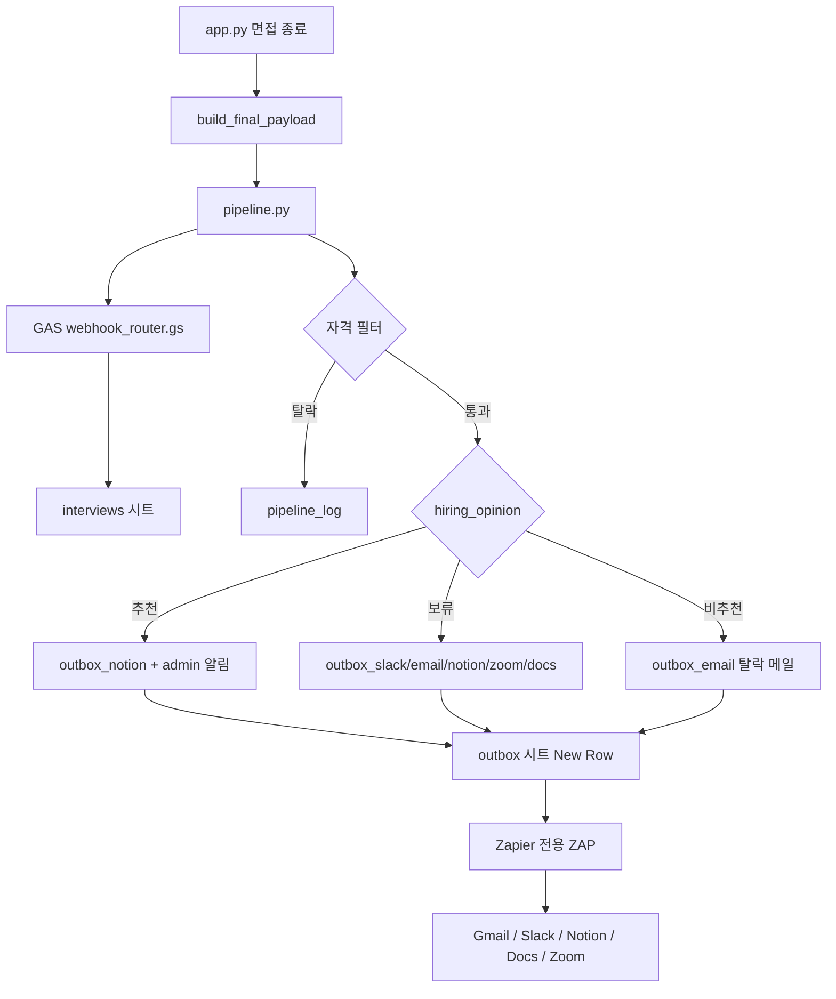

# 🎓 HireCopilot — AI 채용 인터뷰 자동화 에이전트

> **학교 프로젝트 MVP**

지원자가 AI 면접관과 한국어로 대화하고, 면접 결과가 Google Sheets에 기록됩니다.  
**2차 채용 자동화는 Python(`pipeline.py`)이 담당**하고, **Zapier는 Gmail/Slack/Notion 등 앱 연결만** 전용 outbox 시트로 처리합니다.

---

## ✨ 주요 특징

### 🤖 AI 면접
- GPT-4o-mini, 포지션별 기준(`recruiter_config.json`), STAR 꼬리질문, 6~8답변 후 종료

### 📊 평가
- 5개 루브릭 (1~5점) + `hiring_opinion`: **추천 / 보류 / 비추천**

### 📤 Google Sheets + outbox 패턴
- `interviews` 탭: 면접 결과 19열 (A~S)
- `outbox_*` 탭: Zapier 전용 큐 (이메일, Slack, Notion, Docs, Zoom)

### 👔 recruiter.py
- 포지션/채용 기준 관리 (port 8502)

### 🛠️ 개발자 모드 / Dummy 모드
- 실시간 채점 패널 / API 키 없이 UI 시연

---

## 📐 2차 파이프라인 아키텍처



**원칙**: 로직(필터, 분기, LLM 2차 질문) = **Python**. 앱 OAuth/연결 = **Zapier (outbox당 1 ZAP)**.

---

## 🗂️ GAS 설정

`gas/webhook_router.gs`를 Apps Script에 배포합니다.

- 스프레드시트: `1swaf7dyRsVRxepLJAXVoPO3YRNV0aPYmcBLL4_tPnbE`
- 배포 → 웹 앱 → URL을 `.env`의 `GAS_WEBHOOK_URL`에 입력

탭이 없으면 GAS가 헤더와 함께 자동 생성합니다.

---

## ⚡ Zapier 전용 ZAP (앱 연결만)

각 outbox 탭마다 **New Spreadsheet Row → 앱 1개** ZAP을 만듭니다.

| outbox 탭 | Trigger | Action | 필드 매핑 |
|---|---|---|---|
| `outbox_email` | New Row | Gmail Send Email | To=COL B, Subject=C, Body=D |
| `outbox_slack` | New Row | Slack DM | User=COL B, Message=C |
| `outbox_notion` | New Row | Create DB Item | Name=B, Notes=D |
| `outbox_docs` | New Row | Insert Text | Text=D (문서 ID는 Zap에서 고정) |
| `outbox_zoom` | New Row | Create Meeting | Topic=B, Start=C, Duration=D |

> ⚠️ 구버전 monolithic Zap(30단계 Paths/Delay)은 **더 이상 필요 없습니다**.

---

## 📁 프로젝트 구조

```
HireCopilot_AI_Agent/
├── app.py
├── pipeline.py
├── gas/webhook_router.gs
├── recruiter.py
├── recruiter_config.json
├── tests/test_pipeline.py
├── requirements.txt
├── .env
├── README.md
├── SETUP.md
└── CLAUDE.md
```

---

## 🚀 실행

👉 **[SETUP.md](SETUP.md)** 참고

```powershell
streamlit run app.py                              # :8501
streamlit run recruiter.py --server.port 8502     # :8502
python -m unittest tests/test_pipeline.py
```

---

## 📊 interviews 컬럼 (A~S)

| A~G | H | **I** | J~S |
|---|---|---|---|
| 타임스탬프~경력 | 적합도 | **채용의견** | 추천이유~전체대화 |

**I열** `hiring_opinion`: `추천` / `보류` / `비추천` — pipeline 분기 기준

---

## ⚙️ 채용 담당자 설정

1. `recruiter.py` 실행 → 암호 로그인
2. 포지션/공통 기준 저장 → `recruiter_config.json`
3. `app.py` 면접에 자동 반영

---
